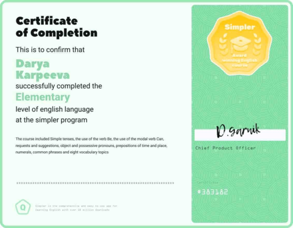

# Darya Karpeeva
***
## Contacts
* __Location:__ Batumi, Georgia
* __Phone:__ +995 557 464234
* __E-mail:__ moredasha@icloud.com
* __GitHub:__ moreDasha
* __Discord:__ moreDasha

***
## About me
I love to learn everything new and exciting. And I can spend a lot of time doing what interests me.
I am attentive to details, assiduous and patient.
I started my way in learning by studying HTML code and I came to rs-school to expand and deepen my knowledge.
I would like to become a specialist in front-end development and I am ready to make every effort to achieve this.

***
## Skills
* HTML
* CSS/SASS/BEM
* VS Code
* Figma

***
## Code example
**Task from CODEWARS:**
Complete the function that takes two integers (a, b, where a < b) and return an array of all integers between the input parameters, including them.
```
function beetween(a,b) {
   const arry = [];
   for(let i = a; i <= b; i++){
   arry.push(i)
   }
   return arry
}
```

***
## Courses
* HTML coding and web-development by ground up on [stepik](https://stepik.org/course/114109/promo)

***
## Languages
* **English** - A2 (Elementary) at the [simpler](https://simpler.link) program

